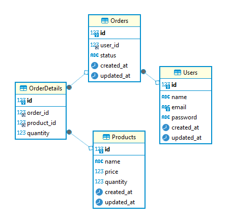

# Mini Project: Database

## Objective
<ol>
<li>Database Schema
<p>Design a database schema to store information about products, users, and orders. Your schema should reflect the relationships between these entities.</p>
</li>

<li>Transaction Management
<p>Implement SQL queries to handle product purchases within transactions. Ensure that the quantity of products is updated atomically when processing orders.</p>
</li>

<li>Race Condition Handling:
<p>Address potential race conditions when multiple users attempt to purchase the same product simultaneously. Implement mechanisms to prevent overselling by checking product availability and updating quantities atomically.</p>
</li>
</ol>

## How to Run
### Prerequisites
- Docker with docker-compose installed

### Steps
1. Clone the repository.
2. Run the following command to start the MySQL database with docker compose. We have provided a `init.sql` script that will create the database and tables for you and the seed data.
```bash
docker-compose up -d
```
3. Connect to the MySQL database using the following command
```bash
docker-compose exec db mysql -u root -p
```
4. Enter the password `password` when prompted.
5. Enjoy the project!

## Database Schema

As shown in the schema below, the database consists of four tables: Users, Products, Orders, and OrderDetails. The Users table stores information about registered users, including their name, email, and password. The Products table contains details about the available products, such as the name, price, and quantity in stock. The Orders table tracks the orders placed by users, including the order status (PENDING, SHIPPED, or DELIVERED). The OrderDetails table stores the details of each order, including the product ID, quantity, and the corresponding order ID. 

With this schema, we can establish relationships between users, products, orders, and order details. For example, each order is associated with a specific user, and each order detail corresponds to a product and an order. This design allows us to maintain data integrity and ensure that the information is organized efficiently.


### DDL Schema
```sql
-- Create table Users
CREATE TABLE Users (
  id INT AUTO_INCREMENT PRIMARY KEY,
  name VARCHAR(255) NOT NULL,
  email VARCHAR(255) UNIQUE NOT NULL,
  password VARCHAR(255) NOT NULL,
  created_at TIMESTAMP DEFAULT CURRENT_TIMESTAMP,
  updated_at TIMESTAMP DEFAULT CURRENT_TIMESTAMP ON UPDATE CURRENT_TIMESTAMP
);
-- Create table Products
CREATE TABLE Products (
  id INT AUTO_INCREMENT PRIMARY KEY,
  name VARCHAR(255) NOT NULL,
  price DECIMAL(10, 2) NOT NULL,
  quantity INT,
  created_at TIMESTAMP DEFAULT CURRENT_TIMESTAMP,
  updated_at TIMESTAMP DEFAULT CURRENT_TIMESTAMP ON UPDATE CURRENT_TIMESTAMP
);
-- Create table Orders
CREATE TABLE Orders (
  id INT AUTO_INCREMENT PRIMARY KEY,
  user_id INT,
  status ENUM('PENDING', 'SHIPPED', 'DELIVERED') DEFAULT 'PENDING',
  created_at TIMESTAMP DEFAULT CURRENT_TIMESTAMP,
  updated_at TIMESTAMP DEFAULT CURRENT_TIMESTAMP ON UPDATE CURRENT_TIMESTAMP,
  FOREIGN KEY (user_id) REFERENCES Users(id)
);
CREATE INDEX idx_orders_user_id ON Orders(user_id);
-- Create table OrderDetails
CREATE TABLE OrderDetails (
  id INT AUTO_INCREMENT PRIMARY KEY,
  order_id INT,
  product_id INT,
  quantity INT,
  FOREIGN KEY (order_id) REFERENCES Orders(id),
  FOREIGN KEY (product_id) REFERENCES Products(id)
);
CREATE INDEX idx_orderdetails_order_id ON OrderDetails(order_id);
CREATE INDEX idx_orderdetails_product_id ON OrderDetails(product_id);
```

### Database Schema Diagram
<center>

</center>


## Transaction Management

### Add New Order Stored Procedure
```sql
DELIMITER //
CREATE PROCEDURE add_order(IN user_id INT)
BEGIN
  INSERT INTO Orders (user_id) VALUES (user_id);
END //
DELIMITER ;
```
This procedure creates a new order record in the Orders table with the specified user ID. By encapsulating this logic in a stored procedure, we can easily add new orders without having to write the INSERT statement manually each time.

Example:
```sql
-- Add a new order for user 1
CALL add_order(1);
```

### Insert Order Stored Procedure
```sql
DELIMITER //
CREATE PROCEDURE insert_order(IN user_id INT, IN order_id INT, IN product_id INT, IN user_quantity INT)

BEGIN
  DECLARE product_quantity INT;

  START TRANSACTION;
  SELECT quantity INTO product_quantity FROM Products WHERE id = product_id FOR UPDATE;

  IF product_quantity < user_quantity THEN
    ROLLBACK;
    SIGNAL SQLSTATE '45000'
      SET MESSAGE_TEXT = 'Not enough stocks';
  END IF;

  INSERT INTO OrderDetails (order_id, product_id, quantity) VALUES (order_id, product_id, quantity);
  UPDATE Products SET quantity = quantity - user_quantity WHERE id = product_id;

  COMMIT;
END //
DELIMITER ;
```
In this stored procedure, we first retrieve the current quantity of the product with the specified ID and lock the row for update to prevent other transactions from modifying it. We then check if the available quantity is sufficient to fulfill the user's order. If there are enough stocks, we insert a new order detail record and update the product's quantity accordingly. If there are not enough stocks, we rollback the transaction and raise an error to indicate that the purchase cannot be completed due to insufficient inventory

Example:
```sql
-- Insert an order for user 1 with order ID 1, product ID 1, and quantity 2
CALL insert_order(1, 1, 1, 2);
```


## Race Condition Handling

As you can see on the `insert_order` stored procedure, we use the `FOR UPDATE` clause to lock the row for update when retrieving the product's quantity. This prevents other transactions from modifying the quantity while we are checking and updating it. By using this mechanism, we can avoid race conditions where multiple users attempt to purchase the same product simultaneously and ensure that the quantity is updated atomically when processing orders.

Additionally, we use the `START TRANSACTION`, `COMMIT`, and `ROLLBACK` statements to manage the transaction and ensure that the changes are applied atomically. If an error occurs during the transaction, we can rollback the changes to maintain data consistency and integrity.